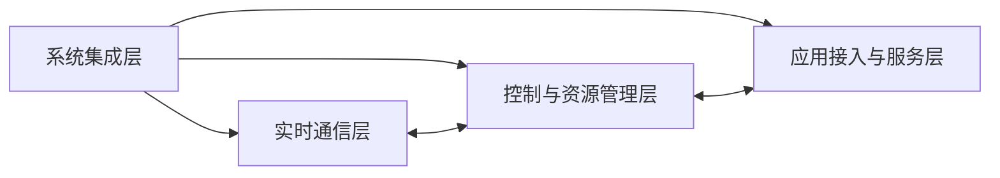

# EtherCAT Slave Controller（ESC）软件架构设计文档

## 1. 文档目的

本文档基于 [ESC_Design_Overview_CN.md](D:/CodexWorkspace/EtherCATSlave/02_SourceCode/ESC_Design_Overview_CN.md)，进一步定义完整 EtherCAT Slave Controller（ESC）的系统架构、层次划分、模块边界、层间接口及关键数据通路。

本文档的目标是将“软件设计概要”细化为可进入寄存器规格设计、模块接口定义和 RTL 详细设计的系统级架构文档。

本文档的功能对标目标为：

- Beckhoff `ET1810 / ET1811 / ET1812`
- `EtherCAT IP Core for Intel/Altera FPGAs V4.0.0`

## 2. 架构设计目标

本架构设计遵循以下原则：

1. 对标 ET1810/ET1811/ET1812 的完整 ESC 功能边界。
2. 数据平面与控制平面严格分离。
3. 物理层适配、实时帧处理、寄存器控制、PDI 接口、DC 时序服务彼此解耦。
4. 所有可配置资源采用参数化架构，包括端口数、FMMU 数、SyncManager 数、PDI 数、DC 配置。
5. PDI0 与 PDI1 独立封装，避免单接口架构后期扩展失控。
6. 过程数据 RAM、User RAM、Private PDI RAM 在架构上独立建模，避免后续仲裁逻辑混乱。
7. 架构应兼容多物理层类型：MII、RMII、RGMII。

## 3. 总体架构层次

ESC 系统采用四层架构：

1. 系统集成层
2. 实时通信层
3. 控制与资源管理层
4. 应用接入与服务层

逻辑关系如下：

## 4. 架构分层说明

### 4.1 系统集成层

系统集成层负责整个 ESC 的顶层组织、时钟复位、全局互联和资源装配。

包含模块：

- `esc_top`
- `esc_reset_clock`
- `esc_status_ctrl`

主要职责：

- 顶层例化所有子模块
- 分发系统时钟与复位
- 配置参数下发
- 组织层间互联
- 汇总状态、特性、告警与中断

系统集成层接口如下：

- 物理层外部接口
- PDI0 外部接口
- PDI1 外部接口
- EEPROM/I2C 接口
- DC Sync/Latch 接口
- GPIO/LED 接口
- 全局中断与状态输出接口

### 4.2 实时通信层

实时通信层负责 EtherCAT 帧的接收、转发、回环、解析、命令执行和 Working Counter 更新，是整个 ESC 的实时核心。

包含模块：

- `esc_port_rx`
- `esc_port_tx`
- `esc_forward_switch`
- `esc_frame_parser`
- `esc_datagram_executor`

主要职责：

- PHY 数据接收与发送适配
- 端口状态驱动的 Auto-Forwarder/Loopback
- EtherCAT 帧解析与数据报边界识别
- EtherCAT 命令执行
- FMMU/SyncManager/寄存器/过程数据 RAM 的访问触发
- 帧内数据修改与工作计数器更新

### 4.3 控制与资源管理层

控制与资源管理层负责寄存器、地址映射、缓冲区一致性、状态机、事件/中断、看门狗以及 DC 和 EEPROM 等资源控制。

包含模块：

- `esc_reg_bank`
- `esc_fmmu_array`
- `esc_sm_array`
- `esc_al_fsm`
- `esc_irq_event`
- `esc_watchdog`
- `esc_eeprom_ctrl`
- `esc_dc_core`
- `esc_sync_latch`
- `esc_feature_rom`
- `esc_pdpram`

主要职责：

- ESC 标准寄存器空间管理
- FMMU 逻辑地址映射
- SyncManager 一致性控制
- AL 状态切换控制
- 中断与事件汇聚
- 看门狗管理
- EEPROM/I2C 访问与 EEPROM 仿真
- DC 时间基、同步与锁存
- User RAM / Feature Mirror 管理
- 过程数据存储子系统管理

### 4.4 应用接入与服务层

应用接入与服务层负责将 ESC 资源暴露给外部应用控制器、主机总线、数字 I/O 逻辑和板级服务接口。

包含模块：

- `esc_pdi0_if`
- `esc_pdi1_if`
- `esc_phy_mi`
- `esc_phy_init_rom_if`
- `esc_gpio_led`
- `esc_output_safe_ctrl`

主要职责：

- PDI0、PDI1 的协议适配
- GPIO 输入输出
- LED 驱动
- PHY 管理与初始化
- 输出安全门控

## 5. 各层级架构接口定义

### 5.1 系统级接口

系统顶层接口按功能可分为六类。

#### 5.1.1 物理通信接口

说明：

- 连接外部 PHY
- 支持 `MII` / `RMII` / `RGMII`
- 支持 `1-4` 个端口

接口集合：

- `phy_port_rx_if[n]`
- `phy_port_tx_if[n]`
- `phy_link_status_if[n]`
- `phy_reset_if[n]`

#### 5.1.2 PHY 管理接口

说明：

- 支持共享 MI 或每端口独立 MI
- 支持动态 PHY 地址配置

接口集合：

- `mi_mgmt_if`
- `mi_mgmt_port_if[n]`
- `phy_addr_cfg_if[n]`
- `phy_init_rom_if`

#### 5.1.3 PDI 接口

说明：

- 面向应用控制器或片上总线主设备
- 支持 PDI0 和 PDI1

接口集合：

- `pdi0_ext_if`
- `pdi1_ext_if`

#### 5.1.4 EEPROM 接口

接口集合：

- `eeprom_i2c_if`
- `eeprom_emul_if`

#### 5.1.5 DC 接口

接口集合：

- `dc_sync_if[0..3]`
- `dc_latch_if[0..3]`

#### 5.1.6 GPIO/LED 接口

接口集合：

- `gpio_in_if`
- `gpio_out_if`
- `led_link_act_if`
- `led_run_if`
- `led_err_if`
- `led_state_run_if`

### 5.2 系统集成层接口

系统集成层向下连接三个内部层次：实时通信层、控制与资源管理层、应用接入与服务层。

#### 5.2.1 `esc_top` 对下接口

`esc_top` 提供如下内部总线与控制接口：

- `clk_rst_if`
- `cfg_param_if`
- `rt_data_path_if`
- `ctrl_status_if`
- `event_irq_if`
- `mem_arb_if`

接口含义如下：

- `clk_rst_if`
  - 全局时钟与复位
  - 包含 `CLK25`、`CLK50`、`CLK100`、`CLK25_2NS`、`CLK_PDI_EXT`、`CLK_PDI1_EXT`
- `cfg_param_if`
  - 端口数
  - PDI 数
  - FMMU 数
  - SyncManager 数
  - RAM 大小
  - DC 配置
- `rt_data_path_if`
  - 帧级流式数据
  - 帧控制标志
  - 数据报执行请求/响应
- `ctrl_status_if`
  - 全局状态
  - AL 状态
  - 端口状态
  - 看门狗状态
  - EEPROM/DC 状态
- `event_irq_if`
  - 事件请求
  - 中断屏蔽
  - 中断输出
- `mem_arb_if`
  - ECAT、PDI0、PDI1、DC、EEPROM 对内部存储资源的访问仲裁

### 5.3 实时通信层接口

实时通信层以流式数据接口为主，同时与控制层通过执行请求接口连接。

#### 5.3.1 端口接收接口 `port_rx_stream_if`

方向：

- `esc_port_rx -> esc_forward_switch`

信号语义：

- `data`
- `valid`
- `sop`
- `eop`
- `error`
- `port_id`
- `timestamp_valid`
- `timestamp_data`

#### 5.3.2 端口发送接口 `port_tx_stream_if`

方向：

- `esc_forward_switch -> esc_port_tx`

信号语义：

- `data`
- `valid`
- `sop`
- `eop`
- `port_id`

#### 5.3.3 转发交换接口 `forward_ctrl_if`

方向：

- `esc_forward_switch <-> esc_status_ctrl`

内容：

- 端口开启/关闭状态
- Auto-Forwarder 路由选择
- Loopback 路由选择
- fallback to port0 控制

#### 5.3.4 帧解析接口 `frame_parse_if`

方向：

- `esc_forward_switch -> esc_frame_parser`

内容：

- 帧头字段
- EtherCAT 类型识别结果
- 数据报偏移
- 解析状态

#### 5.3.5 数据报执行接口 `datagram_exec_if`

方向：

- `esc_frame_parser -> esc_datagram_executor`

内容：

- EtherCAT command
- address mode
- address
- length
- irq side effect flag
- working counter update enable

#### 5.3.6 控制访问接口 `ecat_access_if`

方向：

- `esc_datagram_executor -> 控制与资源管理层`

内容：

- `target_type`
  - reg
  - fmmu
  - syncmanager
  - process_ram
  - user_ram
- `read_req`
- `write_req`
- `addr`
- `be`
- `wdata`
- `rdata`
- `done`
- `err`

### 5.4 控制与资源管理层接口

#### 5.4.1 寄存器访问接口 `csr_if`

参与模块：

- `esc_datagram_executor`
- `esc_pdi0_if`
- `esc_pdi1_if`
- `esc_reg_bank`

内容：

- `req`
- `wr`
- `addr`
- `be`
- `wdata`
- `rdata`
- `ack`
- `err`
- `source_id`

#### 5.4.2 FMMU 映射接口 `fmmu_map_if`

参与模块：

- `esc_datagram_executor`
- `esc_fmmu_array`
- `esc_pdpram`

内容：

- 逻辑地址输入
- 命中标志
- 映射后物理地址
- bit offset
- access direction
- mapping valid

#### 5.4.3 SyncManager 控制接口 `sm_ctrl_if`

参与模块：

- `esc_datagram_executor`
- `esc_sm_array`
- `esc_watchdog`
- `esc_irq_event`
- `esc_output_safe_ctrl`

内容：

- SM 选择
- buffer switch request
- mailbox mode status
- buffered mode status
- sequential mode enable
- deactivation delay enable
- watchdog trigger
- event request

#### 5.4.4 存储访问接口 `mem_access_if`

参与模块：

- `esc_datagram_executor`
- `esc_pdi0_if`
- `esc_pdi1_if`
- `esc_dc_core`
- `esc_eeprom_ctrl`
- `esc_pdpram`

内容：

- `master_id`
- `mem_region`
  - process_ram
  - private_pdi_ram
  - user_ram
- `req`
- `wr`
- `addr`
- `be`
- `wdata`
- `rdata`
- `grant`
- `done`

#### 5.4.5 AL 状态控制接口 `al_ctrl_if`

参与模块：

- `esc_reg_bank`
- `esc_al_fsm`
- `esc_sm_array`
- `esc_fmmu_array`
- `esc_output_safe_ctrl`

内容：

- AL control request
- AL target state
- AL current state
- AL status code
- mailbox ready
- sm_valid
- fmmu_valid
- outputs_safe

#### 5.4.6 事件中断接口 `irq_event_if`

参与模块：

- `esc_sm_array`
- `esc_watchdog`
- `esc_eeprom_ctrl`
- `esc_dc_core`
- `esc_reg_bank`
- `esc_irq_event`
- `esc_pdi0_if`
- `esc_pdi1_if`

内容：

- event_source
- event_vector
- mask_vector
- request_vector
- irq_pdi0
- irq_pdi1

#### 5.4.7 EEPROM 接口 `eeprom_ctrl_if`

参与模块：

- `esc_reg_bank`
- `esc_eeprom_ctrl`
- `esc_pdi0_if`
- `esc_pdi1_if`

内容：

- eeprom command
- eeprom owner
- eeprom address
- eeprom write data
- eeprom read data
- loaded flag
- crc error
- emulation mode enable

#### 5.4.8 DC 控制接口 `dc_ctrl_if`

参与模块：

- `esc_reg_bank`
- `esc_dc_core`
- `esc_sync_latch`
- `esc_irq_event`

内容：

- system time read/write
- receive time capture
- sync pulse configuration
- latch capture configuration
- event time enable
- speed counter direct control
- sync-to-event mapping

### 5.5 应用接入与服务层接口

#### 5.5.1 PDI 抽象接口 `pdi_host_if`

该接口是 PDI0/PDI1 面向控制层的统一抽象。

内容：

- `req`
- `wr`
- `addr`
- `be`
- `wdata`
- `rdata`
- `ack`
- `irq`
- `busy`

#### 5.5.2 PDI0 外部接口

PDI0 支持以下协议封装：

- `pdi0_dio_if`
- `pdi0_spi_if`
- `pdi0_uc_async_if`
- `pdi0_avalon_if`
- `pdi0_axi4_if`
- `pdi0_axi4lite_if`

#### 5.5.3 PDI1 外部接口

PDI1 支持以下协议封装：

- `pdi1_dio_if`
- `pdi1_spi_if`
- `pdi1_avalon_if`
- `pdi1_axi4_if`
- `pdi1_axi4lite_if`

#### 5.5.4 PHY 管理接口 `phy_mgmt_if`

内容：

- `mclk`
- `mdio_in`
- `mdio_out`
- `mdio_oe`
- `phy_addr`
- `phy_reset`

#### 5.5.5 GPIO/LED 服务接口 `gpio_led_if`

内容：

- `gpio_in`
- `gpio_out`
- `gpio_oe`
- `led_link_act`
- `led_run`
- `led_err`
- `led_state_run`
- `led_test_en`

## 6. 架构层次与模块归属关系

### 6.1 L0 系统层

模块：

- `esc_top`

接口：

- 所有外部板级接口
- 所有层间互联接口

### 6.2 L1 子系统层

子系统划分如下：

1. 端口与转发子系统
2. 帧处理子系统
3. 寄存器与状态子系统
4. FMMU/SyncManager 子系统
5. 存储子系统
6. AL 与事件子系统
7. EEPROM/DC 子系统
8. PDI0/PDI1 子系统
9. GPIO/LED/PHY 服务子系统

### 6.3 L2 功能模块层

每个子系统内部由具体功能模块组成：

- 端口与转发子系统
  - `esc_port_rx`
  - `esc_port_tx`
  - `esc_forward_switch`
- 帧处理子系统
  - `esc_frame_parser`
  - `esc_datagram_executor`
- 寄存器与状态子系统
  - `esc_reg_bank`
  - `esc_status_ctrl`
  - `esc_feature_rom`
- FMMU/SyncManager 子系统
  - `esc_fmmu_array`
  - `esc_sm_array`
- 存储子系统
  - `esc_pdpram`
- AL 与事件子系统
  - `esc_al_fsm`
  - `esc_irq_event`
  - `esc_watchdog`
  - `esc_output_safe_ctrl`
- EEPROM/DC 子系统
  - `esc_eeprom_ctrl`
  - `esc_dc_core`
  - `esc_sync_latch`
- PDI0/PDI1 子系统
  - `esc_pdi0_if`
  - `esc_pdi1_if`
- GPIO/LED/PHY 服务子系统
  - `esc_gpio_led`
  - `esc_phy_mi`
  - `esc_phy_init_rom_if`

### 6.4 L3 协议/适配层

L3 为每个复杂模块内部的协议细分层，例如：

- `pdi0_spi_adapter`
- `pdi0_axi_adapter`
- `pdi1_avalon_adapter`
- `rgmii_rx_adapter`
- `mii_tx_shift_adapter`
- `dc_sync_gen`
- `dc_latch_capture`

本层不直接对系统暴露，而作为模块内部实现层存在。

## 7. 关键数据流说明

### 7.1 EtherCAT 实时数据流

数据路径：

1. 外部 PHY 将帧送入 `esc_port_rx`
2. `esc_port_rx` 形成统一流式帧接口
3. `esc_forward_switch` 根据端口状态执行 Auto-Forwarder/Loopback
4. `esc_frame_parser` 完成 EtherCAT 帧识别和数据报解析
5. `esc_datagram_executor` 根据命令访问 `esc_reg_bank`、`esc_fmmu_array`、`esc_sm_array`、`esc_pdpram`
6. 修改后的帧重新注入 `esc_forward_switch`
7. `esc_port_tx` 将结果发往目标端口

### 7.2 PDI 数据流

数据路径：

1. 外部主机通过 `esc_pdi0_if` 或 `esc_pdi1_if` 发起访问
2. PDI 协议适配后转为统一 `pdi_host_if`
3. 根据访问地址路由到：
   - `esc_reg_bank`
   - `esc_pdpram`
   - `esc_eeprom_ctrl`
   - `esc_irq_event`
4. 返回数据或状态给主机

### 7.3 DC 数据流

数据路径：

1. 端口 RX 路径产生接收时间戳
2. 时间戳送入 `esc_dc_core`
3. `esc_dc_core` 更新 system time、receive time、event time
4. `esc_sync_latch` 生成 Sync 信号并采集 Latch 输入
5. 相关事件送入 `esc_irq_event`

### 7.4 EEPROM 数据流

数据路径：

1. `esc_reg_bank` 接收 EEPROM 命令
2. `esc_eeprom_ctrl` 根据模式选择：
   - I2C EEPROM 实体访问
   - EEPROM 仿真桥接
3. 结果更新 EEPROM 状态寄存器与 loaded 标志

## 8. 时钟与复位架构

系统时钟包括：

- `CLK25`
- `CLK50`
- `CLK100`
- `CLK25_2NS`
- `CLK_PDI_EXT`
- `CLK_PDI1_EXT`

时钟域划分如下：

1. EtherCAT 核心时钟域
2. PDI0 时钟域
3. PDI1 时钟域
4. RGMII 辅助时钟域
5. MI/PHY 管理辅助时钟域

复位架构包括：

- 外部全局复位 `NRESET`
- ECAT Reset
- PDI Reset
- RESET_OUT 级联复位
- 子模块局部同步复位

跨时钟域接口要求：

- PDI0/PDI1 到 CSR 接口必须使用同步桥或异步 FIFO
- DC 时间戳与核心状态接口必须使用单向脉冲同步
- AXI/Avalon 外部时钟与核心时钟异步时必须插入 CDC 层

## 9. 内部存储架构

内部存储分为四类：

1. 寄存器空间
2. User RAM / Feature Mirror
3. Process Data RAM
4. Private PDI RAM

访问主设备包括：

- EtherCAT datagram executor
- PDI0
- PDI1
- DC core
- EEPROM control

仲裁原则：

1. EtherCAT 实时数据路径优先于低优先级调试访问。
2. AL、SyncManager、FMMU 相关控制访问优先于普通用户 RAM 访问。
3. PDI0 与 PDI1 对 Private PDI RAM 访问应支持公平仲裁。
4. User RAM Feature Mirror 的只读区域禁止被普通路径错误写入。

## 10. 接口命名与抽象约束

为便于 RTL 详细设计，接口命名应遵循以下规则：

- 帧流接口统一使用 `*_stream_if`
- CSR 接口统一使用 `*_csr_if`
- 内存接口统一使用 `*_mem_if`
- 事件接口统一使用 `*_event_if`
- 中断接口统一使用 `*_irq_if`
- PHY 管理接口统一使用 `*_mi_if`
- PDI 抽象主机接口统一使用 `pdi_host_if`

接口抽象约束如下：

1. 所有总线接口必须定义请求、应答、错误三类基本语义。
2. 所有跨层接口必须显式标识方向与时钟域归属。
3. PDI0 与 PDI1 共享抽象模型，但实例化接口必须物理分离。
4. Feature Mirror 与寄存器访问应分离为不同抽象接口，避免副作用混杂。

## 11. 后续详细设计输入

本文档将作为以下详细设计文档的输入基线：

1. 寄存器规格说明
2. FMMU 详细行为说明
3. SyncManager 详细行为说明
4. PDI0/PDI1 接口详细设计
5. DC 详细设计
6. EEPROM/仿真详细设计
7. 内存仲裁设计
8. 顶层 RTL 接口定义

## 12. 总结

本架构文档已经将 ESC 系统明确划分为：

- 系统集成层
- 实时通信层
- 控制与资源管理层
- 应用接入与服务层

并进一步将其展开为：

- L0 系统层
- L1 子系统层
- L2 功能模块层
- L3 协议/适配层

同时，文档已定义每个架构层级的职责、层间接口、关键数据流、时钟复位架构和内部存储组织方式。基于本文档，后续可以直接进入寄存器规格和 RTL 模块接口详细设计阶段。
